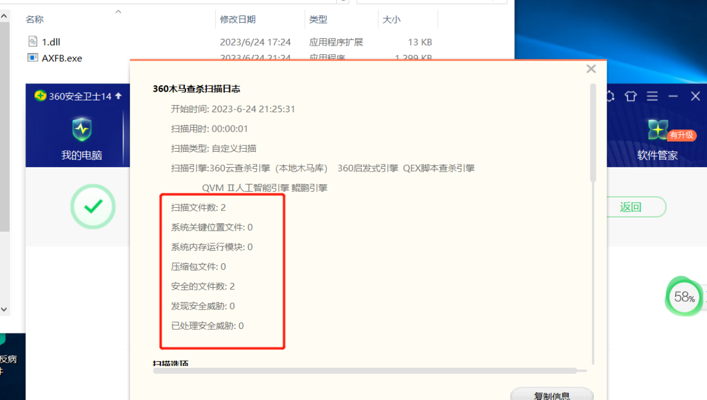
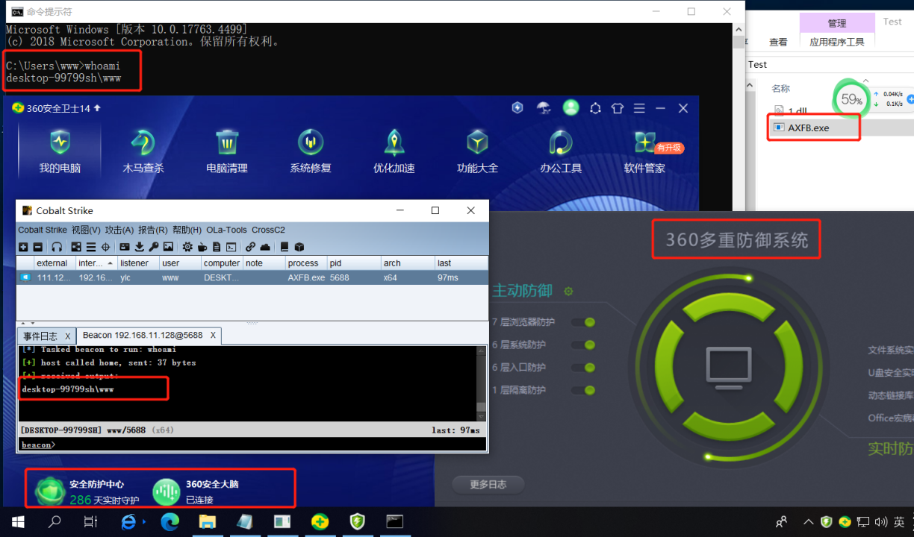
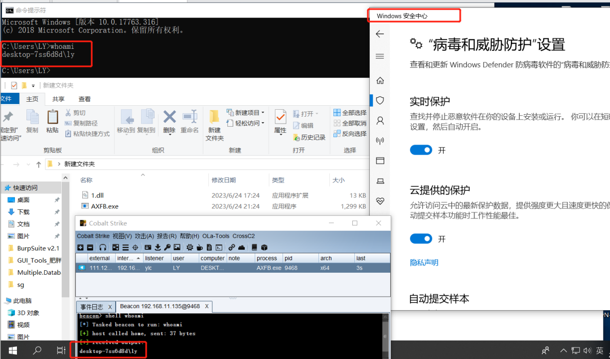
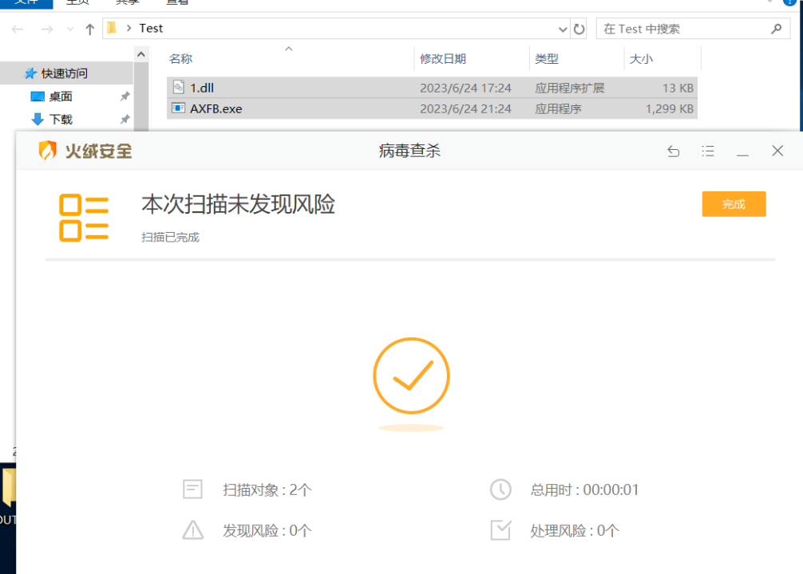
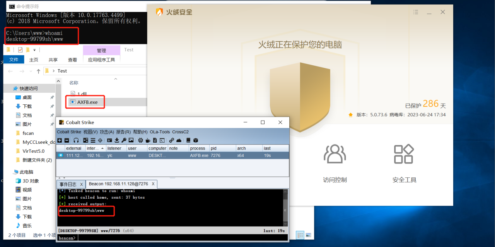
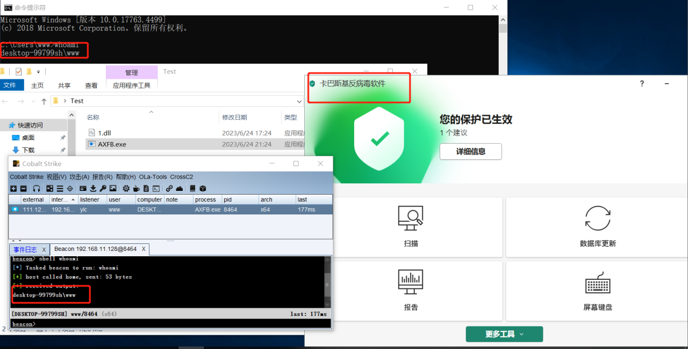

## 0xUBypass
### Description:
这是一个基于纯汇编语言绕过动/静态检测的Shellcode Loader，也可以直接当做免杀使用，使用了2048位秘钥的RSA进行防止逆向，可以有效避免被溯源，当然，需要携带秘钥作为启动参数

### Requirements:
开发环境为VS 2017，当然你也可以适当更改代码使得它可以在新版运行，编译为64位的

shellcode要求为64位的shellcode，当然，你可以在 https://github.com/Yeuoly/0xUBypass/blob/master/WindowsShellcodeInjector/WindowsShellcodeInjector.cpp#L41 这里看到，编译出来的程序是64位的，所以shellcode得是64位

### Bypass
操作系统：Win10 64位
杀毒软件：360全家桶(360安全卫士、360杀毒)，火绒，windows defender，卡巴斯基，更多的暂时没有测试<br>
C2及版本：CobaltStrike 4.4
- [x] 360


- [x] Windows Defender

- [x] 火绒


- [x] 卡巴斯基


### Usages
#### 不带脑子
在
https://github.com/Yeuoly/0xUBypass/releases/tag/1.0.0
下载release，然后准备一个64位的shellcode，替换掉release中改的shellcode，然后运行即可
```go
go run go.go ./shellcode1.bin
```
会生成一个exe，点开就行，默认是弹计算器

#### 使用golang加载DLL
感谢 [A10nggg](https://github.com/A10nggg) 师傅的贡献，现在可以使用golang加载DLL了

使用方法如下

如果你不喜欢默认的C++加载器，你也可以使用golang加载器，毕竟C++的特征过于明显，很容易被杀软检测到，使用方法如下

1. 首先你需要将本项目编译为DLL
2. 使用go编译go_bundle.go生成木马文件

```bash
go run go_bundle.go muma
```
其中muma为生成的木马文件名，可以自定义，具体建议看代码

3. 将生成的木马文件和DLL文件放在同一目录下，然后运行木马文件即可

#### 直接使用
首先准备好一段shellcode（RAW编码）保存在aaa.bin（命名随意）中，然后使用UBypass进行加密，如下
```bash
PS D:\Data\fixable\code\WindowsShellcodeInjector\Release> .\WindowsShellcodeInjector.exe .\calc.bin
[*] Generated Private Key => gPT6SIbOa;od,u`vbg/;:kcS;k+=S%@ob]Cz&~\<=
[*] Your Padding Original Shellcode Size is 280
[*] Your Padding Encrypted Shellcode Size is 560
[*] Your Encrypted Shellcode is f30d0f241eafbe062451e23a3ede47419f06cbc36802ea49e23beb1caaa3dc008f4fa95bf85cc18235383bc8593411345e4485af8cd58a52e9500e0d5664760a99d5ef9d0727d70d582563959b016b1c2069a149cdddcd5fc
```

随后会在当前文件夹生成一个Kawaii.exe即为携带了你的shellcode的马子，使用的时候加上私钥即可，如下
```bash
PS D:\Data\fixable\code\WindowsShellcodeInjector\Release> .\Kawaii.exe 'gPT6SIbOa;od,u`vbg/;:kcS;k+=S%@ob]Cz&~\<='
```

### 免责声明
本项目仅供学习交流使用，请勿用于非法用途，否则后果自负，与本人无关

本项目仅提供一个已经编译好的dll在release中

https://github.com/Yeuoly/0xUBypass/releases/tag/1.0.0
